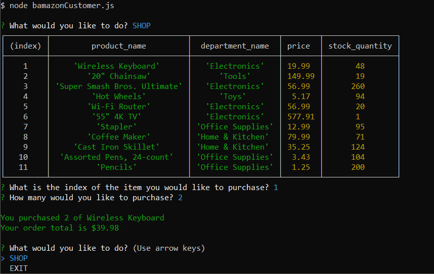
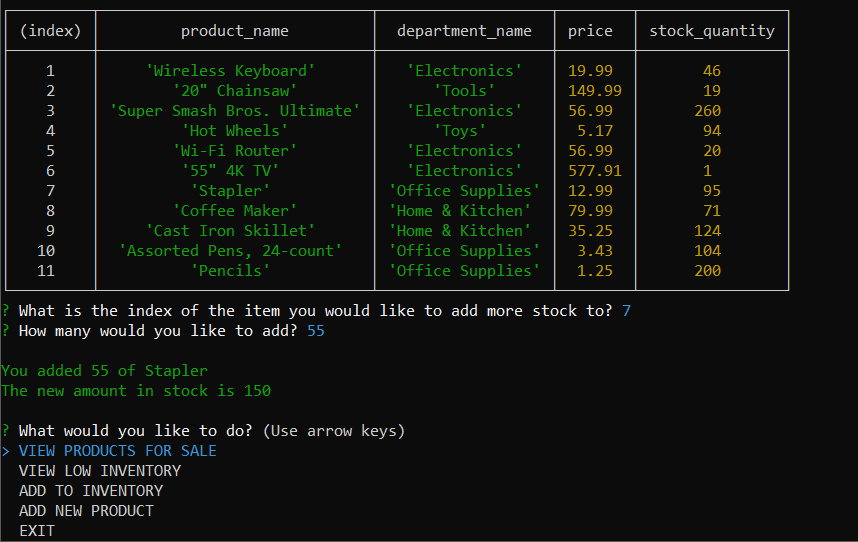
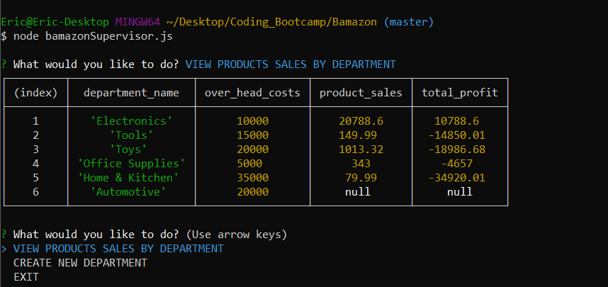

# Bamazon
Bamazon is an example of a storefront with products in a database. Customers can order items and deplete stock, managers can re-stock or add new items, and supervisors can track profits of each department. All product info is stored and retrieved from a MySQL database.

## Customer View
Customers can shop and deplete stock from the products listed.

[Video of Customer View](https://www.youtube.com/watch?v=Z5EguHRPwl0)

## Manager View
Managers can view products for sale, view products with low inventory, add inventory to a product, or add a new product.

[Video of Manager View](https://www.youtube.com/watch?v=DWGLg2m9G0Y)

## Supervisor View
Supervisors can view product sales by department, and create new departments.

[Video of Supervisor View](https://www.youtube.com/watch?v=qy0d4rDZyXw)

